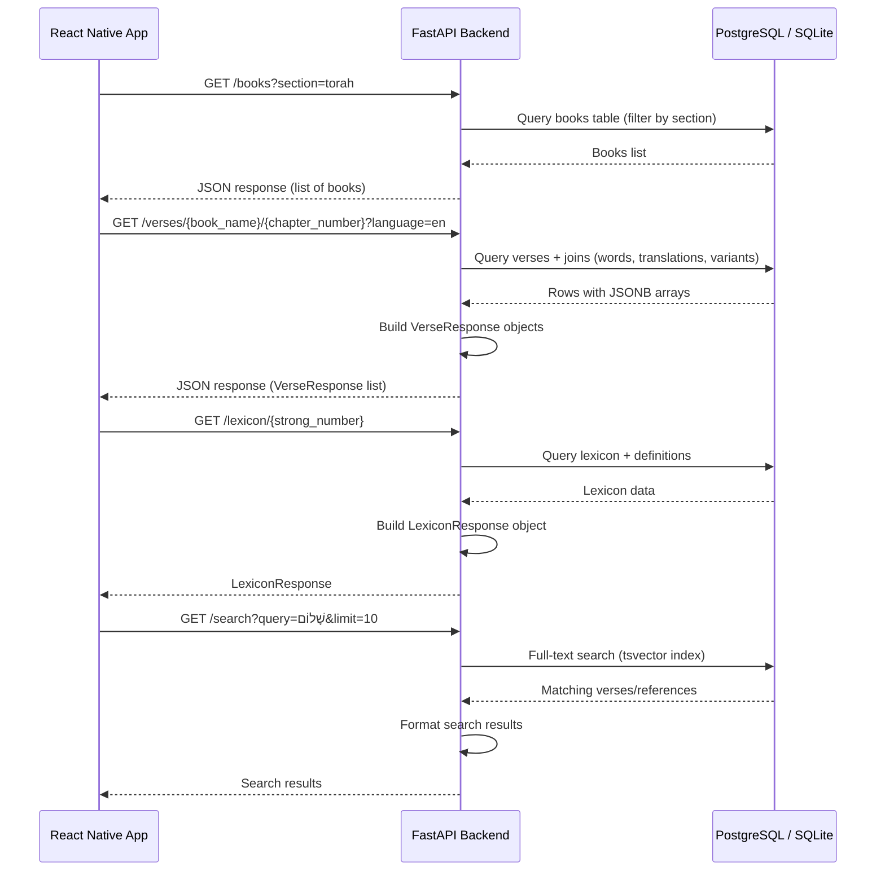

# Diseño del API - Davar

Diagrama de secuencia que muestra el flujo de comunicación entre la aplicación React Native, el backend FastAPI y la base de datos PostgreSQL/SQLite.



## Endpoints Principales

### GET /books
- **Parámetros opcionales**: `section` (book_section enum)
- **Respuesta**: Lista de libros con metadata (name, hebrew_name, section, etc.)

### GET /verses/{book_name}/{chapter_number}
- **Parámetros opcionales**: `language` (translation_language enum)
- **Respuesta**: Lista de `VerseResponse` con:
  - Texto hebreo (con y sin nikud)
  - Palabras con posición, lemma, strong_number
  - Traducciones según idioma solicitado
  - Variantes Qumrán si existen
  - Visual uncertainty markers

### GET /lexicon/{strong_number}
- **Respuesta**: `LexiconResponse` con:
  - Lemma, transliteración, pronunciación
  - Definiciones múltiples (custom + Strong/BDB)
  - Ocurrencias del término en las Escrituras

### GET /search
- **Parámetros**: `query` (texto de búsqueda), `limit` (default: 10)
- **Implementación**: Full-text search usando PostgreSQL `tsvector` para eficiencia
- **Respuesta**: Versos y referencias que coinciden con la búsqueda

## Modelos de Respuesta (Pydantic)

### VerseResponse
```python
{
    "id": "uuid",
    "number": 1,
    "hebrew_text": "בְּרֵאשִׁית",
    "hebrew_no_nikud": "בראשית",
    "words": [{"position": 1, "hebrew": "...", "strong_number": "H7225"}],
    "translations": [{"language": "en", "text": "In the beginning"}],
    "variants": [{"source": "qumran", "variant_text": "..."}],
    "visual_uncertainty": ["word1", "word2"]
}
```

### LexiconResponse
```python
{
    "strong_number": "H7225",
    "lemma": "רֵאשִׁית",
    "definitions": [...],
    "occurrences": {...}
}
```


