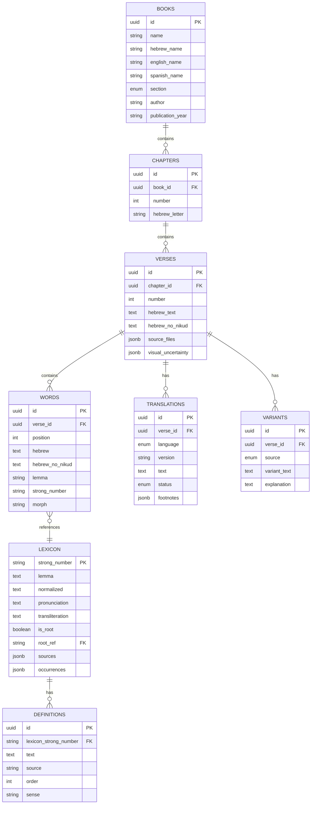

# Esquema de Base de Datos - Davar

Diagrama ER del esquema de base de datos PostgreSQL con UUIDs, enums y campos JSONB.

## Enums

- `book_section`: `torah`, `neviim`, `ketuvim`, `besorah`
- `translation_language`: `en`, `es`
- `translation_status`: `present`, `absent`
- `variant_source`: `qumran`, `masoretic`, `septuagint`

## Extensiones PostgreSQL

- `uuid-ossp`: Para generar UUIDs automáticamente

## Notas

- Todas las tablas usan UUID como primary key (excepto LEXICON que usa `strong_number`)
- Los campos JSONB permiten almacenar estructuras flexibles (source_files, visual_uncertainty, sources, occurrences, footnotes)
- Las relaciones FK mantienen integridad referencial entre entidades

