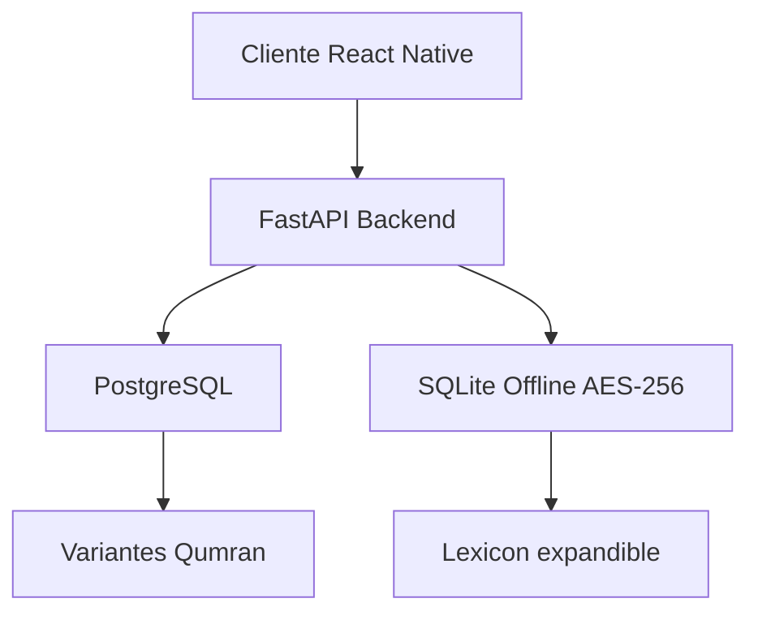
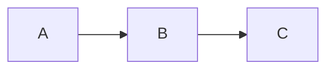

# Prueba Mermaid nativo

```mermaid
graph TD
    A[Cliente React Native] --> B[FastAPI Backend]
    B --> C[PostgreSQL]
    B --> D[SQLite Offline AES-256]
    C --> E[Variantes Qumran]
    D --> F[Lexicon expandible]
```

## Versión simplificada para prueba

```mermaid
graph LR
    A --> B
    B --> C
```